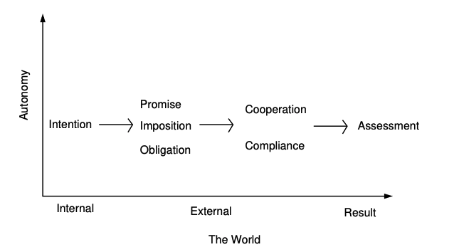

### The Aims of Promise Theory

The aims of **Promise Theory** include:

* **To clarify the role of intent and its possible interpretations**, within a framework that unifies dynamic and semantic aspects of behaviour.
  *This aim focuses on understanding how intentions—whether human or machine—shape behaviour, and how these intentions can be interpreted consistently within systems that involve change (dynamics) and meaning (semantics).*

* **To define a practical notation for documenting intended and unintended behaviour.**
  *Promise Theory seeks to create a clear and systematic way to express what agents intend to do (and sometimes what they unintentionally do), making it easier to describe, analyse, and communicate complex systems of interaction.*

* **To derive a practical calculus or algebra for answering questions about systems of promises**, e.g.:

  * When are there too many or too few promises to conclude that something is likely?
  * When are the promises inconsistent with one another?
    *This goal involves developing analytical tools or rules to reason about networks of promises—helping determine consistency, sufficiency, and reliability in cooperative systems.*

> *Source: Mark Burgess & Jan A. Bergstra,* **The Book of Promises**, Chapter 1: “What Does Promising Mean?”

---

### Tenets of Promise Theory

The **basic tenets of Promise Theory** can be summarized as follows:

1. **Agents are autonomous.**

   They can only make promises about their own behaviour.
   *No agent can impose a promise on another.*
   *This establishes autonomy as the core principle of Promise Theory—each agent governs itself and voluntarily chooses its commitments.*

2. **Making a promise involves passing information to an observer, but not necessarily in the explicit form of a linguistic message.**

   *Promises may be conveyed through any observable behaviour or signal, not just language. The essence is the communication of intent, not the medium used.*

3. **The assessment of whether a promise is kept or not may be made independently by any agent within its scope.**

   *Each observer forms its own evaluation of promise-keeping. There is no single “objective” arbiter; assessments are relative to perspective and information.*

4. **The interpretation of a promise’s intent may be made independently by any agent in its scope.**
   *Understanding and meaning are subjective; different agents may interpret the same promise differently based on their own context and knowledge.*

5. **The internal workings of agents are assumed to be unknown.**
   Knowledge about them may be inferred from the promises they make and keep.

   *Agents are treated as black boxes; we understand them through their behaviour and expressed commitments. The boundaries of what constitutes an “agent” can vary—for example, we might treat a car as a single autonomous entity or as a collection of interacting components (engine, sensors, etc.) that together form a super-agent.*

> *Source: Jan A. Bergstra & Mark Burgess,* **The Book of Promises**, Chapter 1: “What Does Promising Mean?”

Here’s the **“Main Concepts”** section rewritten in clear, structured **Markdown** format for easy reading and note-taking:

---

### Main Concepts in Promise Theory

#### **Intention**

A subject or type of possible behaviour — something that can be interpreted as significant.
Any agent can hold or express intentions.
*Examples:*

* A traffic light may have the intention to **“be red.”**
* A person may have the intention to **“win the race.”**
  Intention represents the internal possibility of an action or state *before it is communicated*.

#### **Promise**

When an intention is **publicly declared** to an audience (called its *scope*), it becomes a promise.
Thus, a promise is a **stated intention**—an explicit expression of what an agent *intends* to do or be.
*Example:* A teacher saying “I will post the grades by Monday” turns a private intention into a public commitment.

#### **Imposition**

An **attempt to induce cooperation** or implant an intention in another agent, without prior invitation or consent.
It is complementary to the idea of a promise but carries an element of the unexpected.
*Degrees of imposition include:*

* hints
* advice
* suggestions
* requests
* commands
  *Example:* “You must finish your report today” is an imposition because it seeks to enforce an action rather than offer voluntary cooperation.

#### **Obligation**

An **imposition that carries a cost or penalty** for non-compliance.
It is more “aggressive” than a mere imposition.
*Example:* A contract clause that fines an employee for missing a deadline creates an obligation, not a simple request.

#### **Assessment**

A **decision about whether a promise has been kept or not.**
Every agent makes its own assessments about the promises it observes.
This process often involves **observing other agents’ behaviours** and interpreting outcomes.
*Example:* After a colleague promises to send you a file, you assess whether that promise was fulfilled once you receive it—or not.

>> NOTE: Promises have **precedence over impositions** in *Promise Theory* because cooperation between autonomous agents can only arise from **voluntary intent**, not coercion. According to Burgess and Bergstra, an imposition (a request, command, or attempt to influence another agent) only works within a **system of pre-existing promises** that define how agents behave, respond, and interact. 
In other words, impositions depend on promises, but promises do not depend on impositions. For instance, a command (“You must do X”) only has meaning if the recipient agent has already promised to **listen**, **understand**, or **consider** such commands. Without those underlying promises, the imposition has no causal or moral force.
The authors make this hierarchy explicit when they write:
>>> “Perhaps surprisingly, promises are more common than impositions and hence take precedence as the instrument of primary focus. Impositions generally only work at all in a system of pre-existing promises. For example, a billiard ball strike only works because the balls are elastic bodies made of atoms that repel one another electrostatically. Promises can often be posited to replace impositions with equivalent voluntary behaviours.”

>> So in Promise Theory:
>> * **Promises** represent **voluntary cooperation** grounded in autonomy.
>> * **Impositions** represent **attempts to induce behaviour**—but these attempts only succeed when the receiving agent’s promises make them possible.

>> This precedence aligns with the core principle that **agents are autonomous** and can only make promises about their own behaviour, not be forced by others.
 

In Figure 1, below, a progression of related promise concepts from left to right starts with forming an intention internally, then bringing this into the world as a promise, imposition or obligation. This
leads to some degree of cooperation of compliance which may then be assessed.

 Figure 1: A progression of related promise concepts

>> NOTE: In Promise Theory, there is a clear difference between intentions and actions or messages. Intentions belong to the semantic level (meaning), actions belong to the dynamic or behavioural level (doing), and messages are the medium that may communicate intentions but are not equivalent to them.

> *Source: Jan A. Bergstra & Mark Burgess,* **The Book of Promises**, Chapter 1: “What Does Promising Mean?”

